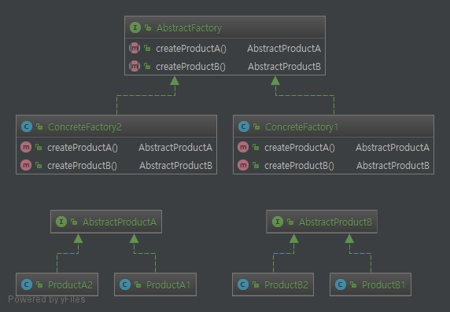
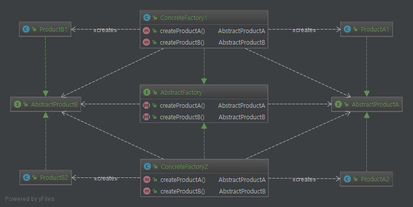

# Abstract Factory Pattern.

# 1. 정의
추상 팩토리 패턴에서는 인터페이스를 이용하여 **서로 연관되거나 의존** 하는 객체를 구상 클래스를 지정하지 않고도 생성하는 방법.

    추상 팩토리 패턴을 사용하면 어떤 제품이 생산되는지도 전혀 알 필요도 없다, 따라서 클라이언트와 팩토리에서 생산되는 제품을 분리 시킬 수 있다.

# 2. 특징

* 객체를 만들기 위한 추상 형식(`Interface`)를 제공한다.
* 팩토리 메소드 패턴과 똑같이 클라이언트와 클라이언트에서 사용하는 실제 구현체가 분리된다.
* 내부적으로 구상 팩토리(`ConcreteFactory`)를 구현할 때 팩토리 메소드를 쓰는 경우가 있다.
* 경우에 따라 `Interface`를 추가 해야 하는 경우가 생길 수도 있어, `Interface` 범위를 크게 잡는다.

# 3. Code

```java
public static void main(String[] args) {

    AbstractFactory factory1 = new ConcreteFactory1();      //구상 클래스

    AbstractProductA productAFromFactory1 = factory1.createProductA();
    AbstractProductB productBFromFactory1 = factory1.createProductB();

    AbstractFactory factory2 = new ConcreteFactory2();      //구상 클래스
    
    AbstractProductA productAFromFactory2 = factory2.createProductA();
    AbstractProductB productBFromFactory2 = factory2.createProductB();

}
```
위 소스에서 보는 추상 팩토리 패턴의 특징은 `AbstractFactory`라는 `Interface`에 객체를 주입 받아 메소드를

호출하는 방식으로 객체를 만드는 것이 특징이다. 팩토리 메소드 패턴은 주로 `Interface`가 아닌 추상 클래스를 사용한다.

# 4. 팩토리 메소드 패턴과 차이점

    둘 다 객체를 만드는 일을 하는점이 공통점이지만 팩토리 메소드는 상속을 통해서 객체를 만들고, 추상 팩토리 패턴은 객체 구성(Compositoin)을 통해 만들게 된다. 간단히 말하면 팩토리 메소드는 클래스를 써서 객체를 만들고, 추상 팩토리 패턴은 구현체를 주입받아 주입된 객체를 통해 새로운 객체를 만들게 된다. 이러한 특징은 아래와 같은 결과를 만들 수 있게 된다.


### 4.1 팩토리 패턴

```java
public class NYPizzaStore extends PizzaStore{
    @Override
    protected Pizza createPizza(String type) {

        if ("cheese".equals(type)){
            return new NYStyleCheesePizza();
        }else if("veggie".equals(type)){
            return new NYStyleVeggiePizza();
        }else {
            return null;
        }
    }
}
```

Type에 따라 하위 클래스(`NYPizzaStore`)에서 객체를 한번에 만들고 있다.

### 4.2 추상 팩토리 패턴

```java
public static void main(String[] args) {

    AbstractFactory factory1 = new ConcreteFactory1();
    
    AbstractProductA productAFromFactory1 = factory1.createProductA();
    AbstractProductB productBFromFactory1 = factory1.createProductB();

    AbstractFactory factory2 = new ConcreteFactory2();
    
    AbstractProductA productAFromFactory2 = factory2.createProductA();
    AbstractProductB productBFromFactory2 = factory2.createProductB();
}
```

팩토리 객체를 한번 만들고(`factory1`, `factory2`) 그 하위 메소드에서 객체를 생성.

`ConcreteFactory1`, `ConcreteFactory2` 클래스는 각 클래스에 연관된 객체(각 `AbstractProductA`, `AbstractProductB`)를 생성할 수 있다. 즉 **여러 종류의 객체를 생성하고, 객체들 사이의 관련성이 있는 경우** 유용하게 써먹을 수 있다.

# 5. Code Class diagram

## 5.1 일반 클래스 다이어그램


## 5.1 dependencies 관계 추가한 클래스 다이어그램


    참고로 클라이언트 에서는 어떠한 Product인지 상관없이 AbstractProduct에 의존관계가 형성된다. 추상 팩토리 패턴만의 특징은 아니지만 그냥 참고!