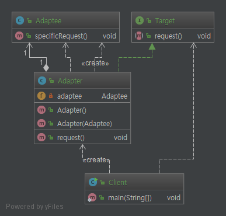
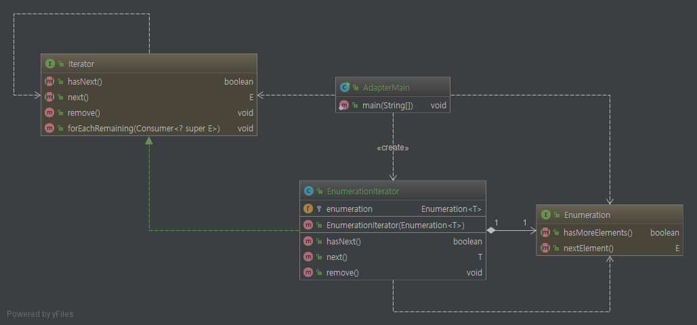

# Adapter Pattern.

# 1. 정의

    한 클래스의 인터페이스를 클라이언트에서 하용하고자 하는 다른 인터페이스로 변환한다.
    어뎁터를 이용하여 비슷한 성격의 다른 인터페이스 호환성 문제 때문에 같이 쓸 수 없는
    클래스들을 연결해서 쓸 수가 있다.

# 2. 특징

* 호환성 문제 해결을 위해 중간 다리 역할을 수행
* 클라이언트 입장에선 어뎁터를 사용하는지 아니면 일반 클래스인지 알 필요없음
* 다중 상속을 지원안하기 때문에 인터페이스를 사용

    유연성을 포기하고 특정 클래스에 종속되도 상관없다면 그냥 클래스를 extends 해서 오버라이드 해서 사용해도
    별 문제는 없을것이라고 생각됨. 물론 인터페이스를 사용하지 않으면 강한결합이 있으므로 차후 유연성이 떨어져
    그 클래스를 바꾸면 다른 소스에도 영향을 미칠 가능성이 매우 높음




위 클래스 다이어 그램을 보면 `Adaptee`와 `Target`간의 중간다리 역할을 하는 `Adapter`클래스가 존재한다.

`Client`에서는 `Adaptee`의 기능을 쓰고 싶으면 `Adapter`를 통해 구현된 `Target`으로 사용이 가능하다.

(`Adaptee`의 존재여부 조차 몰라도 상관이 없다)


# 3. Code

```java
public class AdapterMain {

    public static void main(String[] args) {

        Vector<String> vector = new Vector<>();
        vector.add("obj0");
        vector.add("obj1");
        vector.add("obj2");

        Enumeration<String> enumeration = vector.elements();
        Iterator<String> enumIter = new EnumerationIterator<>(enumeration);

        while (enumIter.hasNext()){
            System.out.println(enumIter.next());
        }
    }
}
```

`Enumeration` 와 `Iterator`의 호환성 문제를 해결하기 위해 중간의 어뎁터 역할을 하는 `EnumerationIterator`를 통해

호환성 문제를 해결하였다. 사실 단순해서 더 할말이 없다...

# 4. Code Class diagram



3에서 나온 코드와 함께 보면 `EnumerationInterator` 클래스를 통해 `Enumeration`를 `Iterator`형태로 변환하여

사용하는 것을 볼수가 있다.
