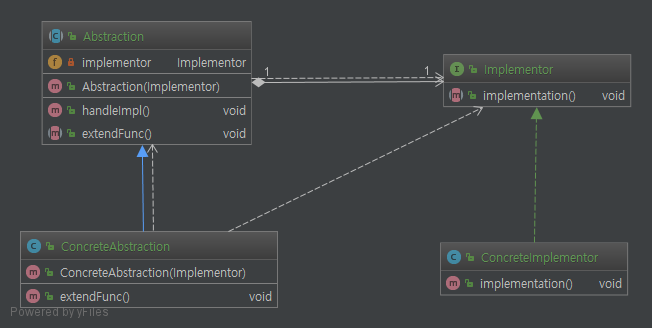
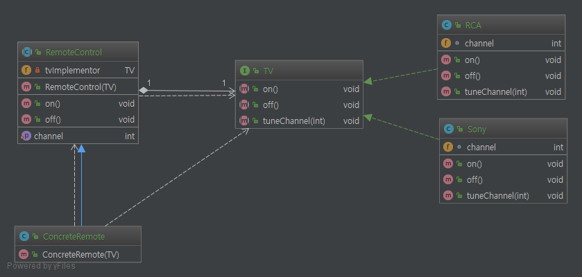

# Bridge Pattern.

# 1. 정의
    구현과 추상화된 부분을 분리하므로 각 의존관계를 줄일 수 있다. 이때 구현과 추상화
    관계를 브릿지(bridge)라고 하여 브릿지 패턴이라 불린다.


# 2. 특징

* 구현을 인터페이스에 완전히 결합시키지 않았기 떄문에 구현과 추상화된 부분을 분리시킬 수 있다.
* 추상화된 부분과 실제 구현 부분을 독립적으로 확장 할 수있다.
* 추상화된 부분을 구현한 구상 클래스를 바꿔도 클라이언트 쪽에는 영향을 미치지 않는다.
* 인터페이스와 실제 구현부를 서로 다른 방식으로 변경해야 하는 경우에 유용하다.


# 3. base 설명

### 3.1 class diagram


### 3.2 설명

```java
public interface Implementor {

    void implementation();
}

public abstract class Abstraction {

    private Implementor implementor;

    public Abstraction(Implementor implementor) {
        this.implementor = implementor;
    }

    public void handleImpl(){
        implementor.implementation();
    }

    public abstract void extendFunc();
}
```

코드를 보면 추상 클래스 인`Abstraction`는 `Implementor` 필드를 `private` 형태로 가지고 있다. 이는 당연히

상속받은 객체를 포함하여 자신 외에 접근 할 수가 없다. 따라서 `Implementor` 필드를 사용하고 싶으면 상위 클래스

에서 사용 함으로써 의존관계는 추상 클래스인 `Abstraction`와 인터페이스 `Implementor`끼리만 의존관계가 형성되고

(참고로 이때 두 관계를 bridge라고 하여 Bridge pattern이다) `Abstraction`를 구현한 클래스(`ConcreteAbstraction`)들은

`Implementor`, `Implementor`의 구현체 `ConcreteImplementor`의 의존관계는 형성되지 않는다. 이렇게 하면서 얻는 장점은

인터페이스가 자주 바뀔 수도 있다면 해당 인터페이스와 의존관계가 있는 클래스만 바꾸면 되기 때문에 편하다.

위의 class diagram에선 `ConcreteAbstraction`과 `Implementor`사이에 의존관계 선이 있지만 이는 생성자 때문에 생긴

관계로 실질적으로는 무시해도 상관없는 의존관계다.

    `Implementor` 인터페이스의 메소드가 추가, 변경되면 `ConcreteImplementor`와 `ConcreteAbstraction`만 바꾸면 되고,
    `Abstraction` 클래스의 메소드가 추가, 변경되면 `ConcreteAbstraction`만 바꾸면 되어 반대쪽에 영향을 미치지 않게 된다.

# 4. remote package class diagram



설명은 사실상 3. base 설명과 별차이가 없으므로 pass
