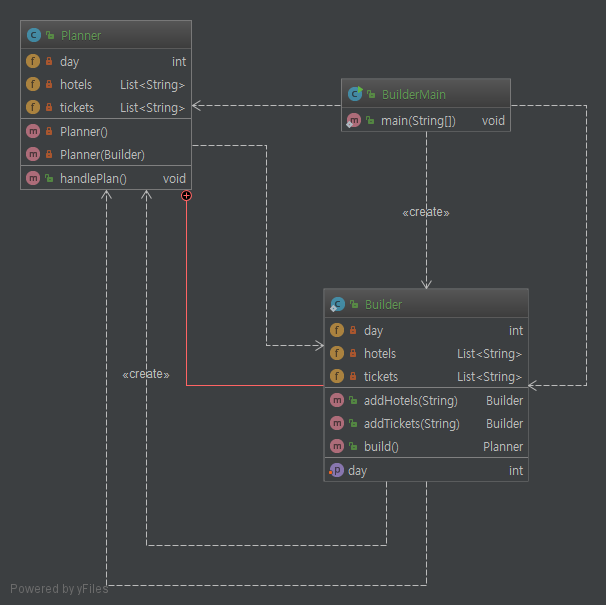
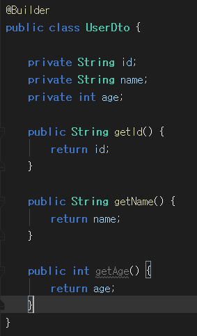
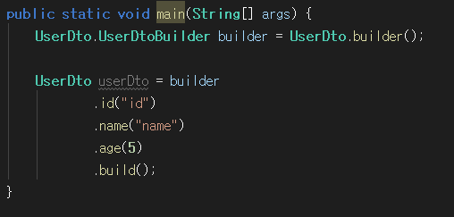

# Builder Pattern.

# 1. 정의
    복합 객체가 생성되는 객체를 캡슐화(Builder) 한다.
    복잡한 객체를 생성하는 방법과 표현하는 방법을 정의하는 클래스를 별도로 분리하여
    서로 다른 표현일도 이를 생성할 수 있는 동일한 구축 과정을 제공할 수 있도록한다.


이때 말하는 생성 하는 방법은 밑에서 말할 `Builder` class, 표현하는 방법은 `Planner` class

# 2. 특징

* 여러 단계와 다양한 절차를 통해서 객체를 만들 수 있다.
* 내부 구조를 클라이언트로 부터 보호할 수 있다(불변객체).
* builder 부분을 바꿔도 클라이언트 쪽에는 영향을 미치지 않는다.
* 객체를 만들기 위해서 클라이언트에 대해 더 많이 알아야 한다.


# 3. Code

### 3.1 class diagram


### 3.2 설명

```java
    public static void main(String[] args) {
    
        Planner planner = new Planner.Builder()
            .setDay(5)
            .addTickets("티켓1")
            .build();
            
        planner.handlePlan();
    }
```

구조 자체는 복잡하지 않지만 내부적으로 많이 사용하는 패턴.

객체를 생성 및 초기화 하는 방식으로 그냥 생성자를 쓰거나 `setter`를 쓸 수도 있겠지만

이는 인자값이 많아져서 헤깔릴 수도 있고, `setter`를 사용함으로써 더 이상 불변객체가 아닌

단점을 보완해줄 수 있다.  단점으로는 `builder`를 만들 떄 클라이언트에 대해 많이 알아야한다. 

# 4. Lombok
Lombok을 통해서 annotation으로 builder 패턴을 구현 할 수가 있다.




