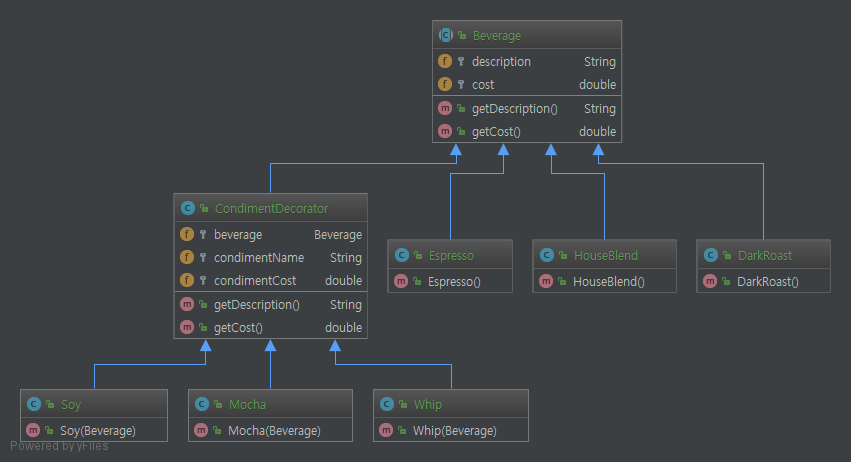
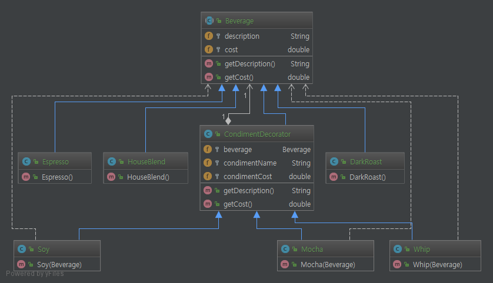

# Decorator Pattern.

# 1. 정의
객체에 추가적인 요건을 동적으로 첨가한다. 데코레이터는 서브 클래스를 만드는 것을 통해

기능을 유연하게 확장할 수 있는 방법을 제공한다.

# 2. 특징

* 데코레이터의 수퍼클래스는 자신이 장식하고 있는 객체의 수퍼 클래스와 같다.
* 한 객체를 여러 개의 데코레이터로 감쌀 수 있다.
* 데코레이터는 자신이 감싸고 있는 객체와같은 수퍼클래스를 가지고 있기 때문에 원래 객체(싸여져 있는 객체)가 들어갈 자리에 데코레이터 객체를 집어넣어도 상관없다.
* 데코레이터는 자신이 장식하고 있는 객체에게 어떤 행동을 위임하는 것 외에 원하는 추가적인 작업을 수행할 수 있다.
* 객체는 언제든지 감쌀 수 있기 때문에 실행중에 필요한 데코레이터를 마음대로 적용 할 수 있다.

# 3. Code

```java
public class DecoratorMain {

    public static void main(String[] args) {
        Beverage darkRoast = new DarkRoast();
        darkRoast = new Mocha(darkRoast);
        darkRoast = new Mocha(darkRoast);
        darkRoast = new Whip(darkRoast);
        System.out.println(darkRoast.getDescription() + ", $" + darkRoast.getCost());
    }
}
```

위에 보는 코드처럼 옵션을 동적으로 추가 해줄 수가 있다.

# 4. Code Class diagram

## 4.1 일반 클래스 다이어그램


## 4.1 dependencies 관계 추가한 클래스 다이어그램
