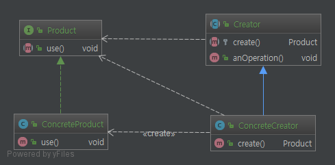
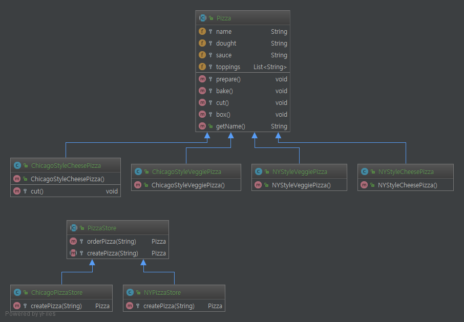
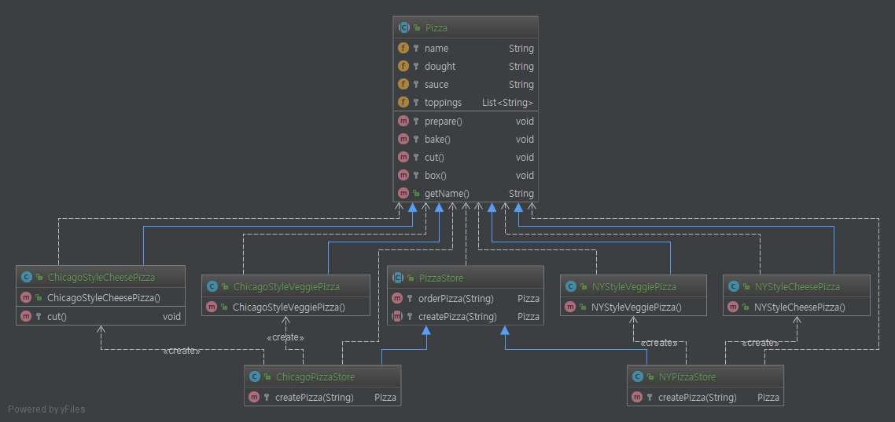

# Factory Method Pattern.

# 1. 정의
팩토리 메소드 패턴에서는 객체를 생성하기 위한 인터페이스를 정의하는데, 어떤 클래스의 인스턴스를 만들지는

서브클래스에서 결정하게 만든다. 팩토리 메소드 패턴을 이용하면 클래스의 인스턴스를 만드는 일을 맡기게 된다.

    '결정한다.'라고 표현하는 이유는, 이 패턴을 사용할 떄 서브클래스에서 실행중에 어떤 클래스의 인스턴스를 만들지를
    결정하기 때문이 아니라, 생산자 클래스 자체가 실제 생산될 제품에 대한 사전 지식이 전혀 없이 만들지지기 때문.
    더 정확히 표현하면 사용하는 서브 클래스에 따라 생산되는 객체 인스턴스가 결정된다.



위 이미지를 보면 `Creator` class에는 제품을 가지고 원하는 일을 하기 위한 모든 메소드 들이 구현

되어 있고(`anOperation`), 제품을 만들어주는 팩토리 메소드는 추상메소드로 정의되어 있다(`create`).

객체를 생성하기 위한 인터페이스를 추상화 하고(`Product` interface) 그 구현체 클래스(`ConcreteProduct`)를

만들어 내는 일은 `ConcreteCreator`가 책임진다. 실제 `Product`를 만들어내는 방법과 어떤 클래스를 결정할 지

알고 있는 클래스는 이 클래스 뿐.


# 2. 특징

* 서브 클래스에서 어떤 클래스의 인스턴스를 만들지를 결정한다.
* 제품을 생산하는 부분과 사용하는 부분을 분리하여 위 소스에서 `Creator`와 `ConcreteCreator`는 느슨한 결합이 된다.
* 객체 생성하는 코드를 캡슐화 한다(`create` method).

# 3. Code

구체화된 클래스가 아닌 추상화 된 인터페이스에 의존하는 점의 장점으로 아래 메소드를 보면
```java
public abstract class PizzaStore {

    protected Pizza orderPizza(String type){

        Pizza pizza = createPizza(type);

        pizza.prepare();
        pizza.bake();
        pizza.cut();
        pizza.box();

        return pizza;
    }

    protected abstract Pizza createPizza(String type);
}

```
위 소스는 `createPizza`라는 추상 method를 통해 `Pizza` interface를 구현체를 주입 받게 된다.

만약 `createPizza`를 사용하지 않고 직접 서술하게 되면 아래와 같은 소스가 될것이다.

```java
public class PizzaStore {
    protected Pizza orderPizza(String type){
    
        Pizza pizza = createPizza(type);
        
        if ("cheese".equals(type)){
            pizza =  new ChicagoStyleCheesePizza();
        }else if("veggie".equals(type)){
            pizza = new ChicagoStyleVeggiePizza();
        }
        //......
        
        pizza.prepare();
        pizza.bake();
        pizza.cut();
        pizza.box();
    
        return pizza;
    }
}
```

위 소스에선 2가지 밖에 없지만 만약 종류가 늘어나게 되면 계속해서 소스는 지저분하게 될것이다.

또한 `orderPizza` method가 있는 Store 구현체 클래스는 하위 `Pizza` product class 들의 의존관계도 심해져

유연함이 확실히 떨어지게 된다(계속해서 모든 Store 구현체 클래스를 수정하게 될것이다).

따라서 `createPizza`라는 추상 method에 의존하면 각 Store 구현체를 수정할 일은 줄어들고, 간결해 진다.


다시 소스를 보며 다시한번 설명하면 `PizzaStore`는 `PizzaStore`를 구현한 서브 클래스(`ChiacgoPizzaStore`, `NYPizzaStore`)들의 사전 지식이 전혀 없이 만들어진다. 왜냐면 `createPizza` 메소드를 서브 클래스로 위임해, 서브 클래스에서 만들어 지기 때문이다. 또한 패턴 내부적으로 템플릿 패턴이 포함되어 있다.

또한 상위 객체에서 객체 생성을 추상화 된 메소드인 **protected abstract Pizza createPizza(String type)** 에 의존(하위에 위임) 했다고도 볼 수 있다.(DI)

# 4. Code Class diagram

## 4.1 일반 클래스 다이어그램


## 4.1 dependencies 관계 추가한 클래스 다이어그램
