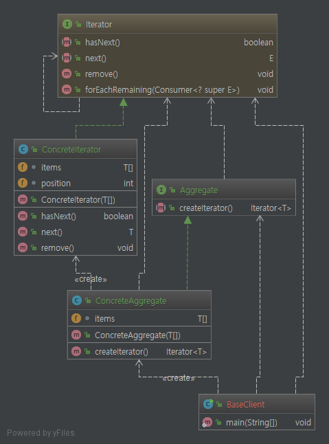
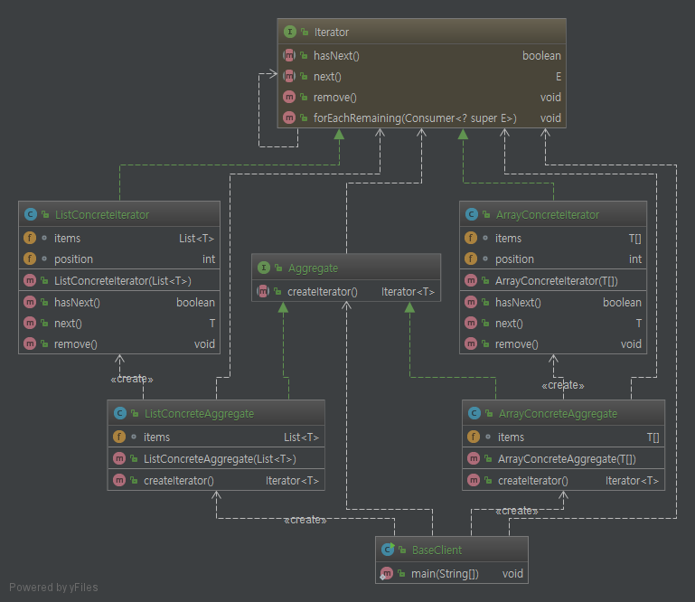

# Iterator Pattern.

# 1. 정의
반복자 패턴이라고도 하며, 컬렉션 구현방법을 노출시키지 않으면서도 그 집합체 안에 들어있는

모든 항목에 접근할 수 있게 해주는 방법을 제공해준다.

# 2. 특징

* 각 항목에 일일이 접근할 수 있게 해주는 기능을 집합체가 아닌 반복자가 객체에서 책임지게 된다.
* 집합체 인터페이스 및 구현이 간단해주기 각자 중요한 일만 처리할수 있게 도와준다.
* 반복하는 부분을 캡슐화 한다(어떤 종류의 집합체라도 적용하여 다형적인 코드를 만들 수 있다).

# 3. Code

```java
public class BaseClient {

    public static void main(String[] args) {
        Aggregate<Integer> intItems = new ArrayConcreteAggregate<>(new Integer[]{1, 2, 3, 4, 5, 6});

        List<String> items = new LinkedList<>();

        items.add("one");
        items.add("two");
        items.add("three");
        items.add("four");

        Aggregate<String> listItems = new ListConcreteAggregate<>(items);
        
        
        Iterator<Integer> intIterator = intItems.createIterator();
        Iterator<String> listIterator = listItems.createIterator();
        
        while(intIterator.hasNext()){
            //...
        }
        
        while(listIterator.hasNext()){
            //...
        }
    }
}
```

소스에서 보는바와 같이 list 형태든 배열 형태든 상관없이 iterator 형태로 만들 수 있게 추상화 하여 반복하여

사용(접근)이 가능하다. client 입장에선 iterator 형태로만 제공받으니까 특정 집합체(배열이든 리스트든 맵이든)

구현 방법을 신경쓰지 않고 접근이 가능하다.

# 4. 클래스 다이어그램

### 4.1 base class diagram



### 4.2 list, array iterator pattern class diagram



사실 핵심 부분이나 응용한거나 사실상 똑같다... base class diagram에선 일단 배열로 사용하였는데 어떤 걸 쓰든 상관이없다.