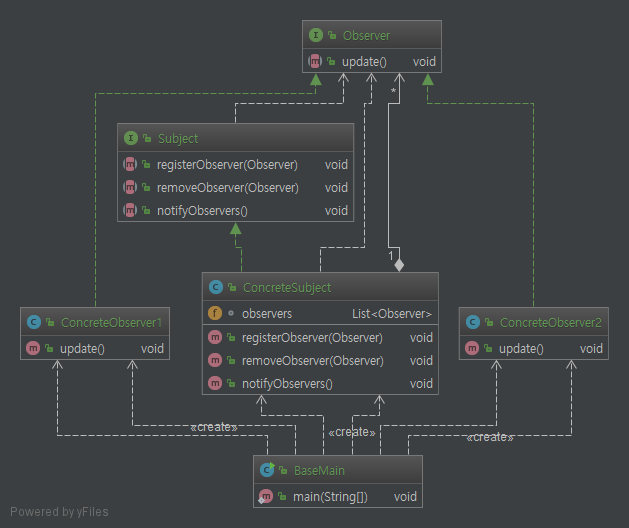
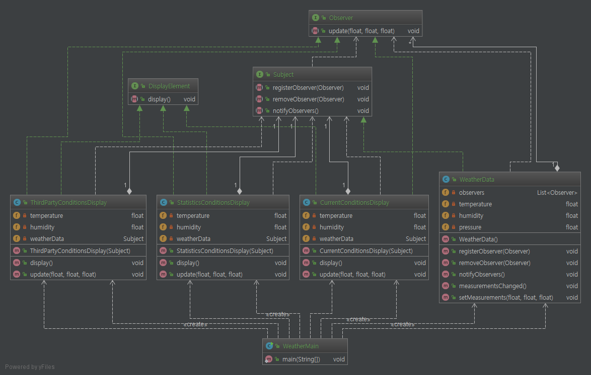
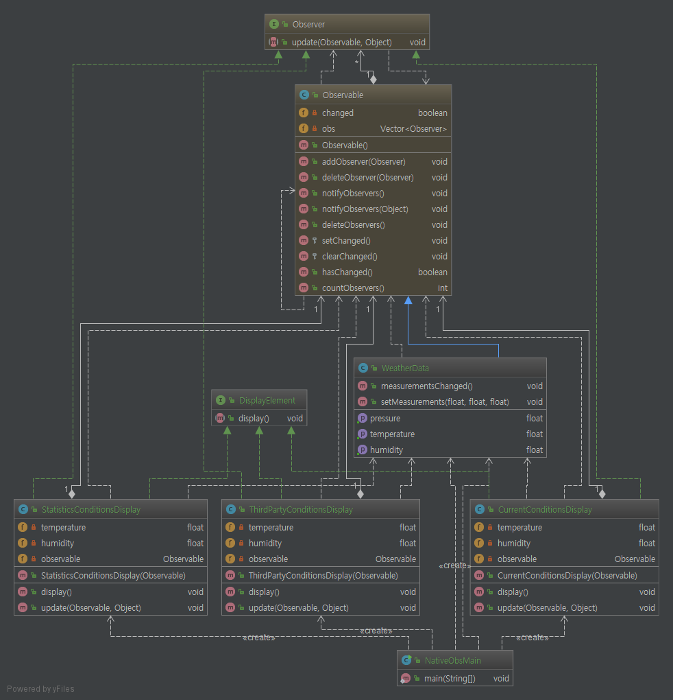

# Observer Pattern.

# 1. 정의
한 객체의 상태가 바뀌면 그 객체에 의존하는 다른 객체들한테 연락이 가고, 자동으로

내용이 갱신되는 방식으로 일대다(one-to-many) 의존성을 정의한다.

# 2. 특징

* 객체들 사이에 일대다 관계를 정의한다.
* 주제(Subject) 또는 Observable 객체는 동일한 인터페이스를 써서 옵저버에 연락을 한다.
* Observable에서는 옵저버들이 Observer 인터페이스를 구현한다는 것을 제외하면 옵저버에 대해 전혀 모르기 때문에, 이들 사이의 결합은 느슨한 결합이다.
* 옵저버 패턴을 이용하면 주제(Subject) 객체에서 데이터를 보내거나(push 방식) 옵저버가 데이터를 가져오는(pull 방식)을 쓸 수 있다.
    pull 방식이 더 옮은 것으로 간주.
* 옵저버들한테 연락을 돌리는 순서에 의존하면 안된다(느슨한 결합이라고 할 수 없다).   

# 3. Code

```java
public static void main(String[] args) {

        WeatherData weatherData = new WeatherData();

        //observer 등록
        new CurrentConditionsDisplay(weatherData);
        new StatisticsConditionsDisplay(weatherData);
        new ThirdPartyConditionsDisplay(weatherData);

        weatherData.setMeasurements(88, 83, 30.4f);
        weatherData.setMeasurements(82, 78, 29.2f);
        weatherData.setMeasurements(70, 88, 29.2f);
    }
```
옵저버 패턴은 변화를 감지하고 있다가 연관된 객체(observer들)에게 변화를 알려주는 패턴이다.

위 소스에서 핵심은 `weatherData`의 내부 값이 `setMeasurements` 메소드를 통해 바뀌면 연관된 객체(current, statistics,

thirdParty)에게 변경을 알려주면 된다. 그러기 위해서 옵저버들을 하나의 객체(위 소스에서 `weatherData`)에 등록하고

`setMeasurements` 메소드에서 각 옵저버들한테 notify하면 된다(`WeatherData`에서 Observer 목록을 관리할 수 있다).


# 4. Code Class diagram

### 4.1 base class diagram



### 4.2 직접 Observer, Subject를 구현한 class diagram(concrete 디렉토리)



### 4.3 내장 Observer, Observable 클래스를 사용한 class diagram




내장된 옵저버 객체는 생각보다 사용하기도 쉽고 API를 봐도 꽤나 직관적으로 이해할 수가 있어서 별도의 설명은 생략!

참고로 thread-safe관련해서나 각 객체에 불필요한 연속된 notify를 줄일수가 있어서 이왕 쓸꺼면 만들어진 `Observable`을

사용하는게 좋을꺼 같다.


