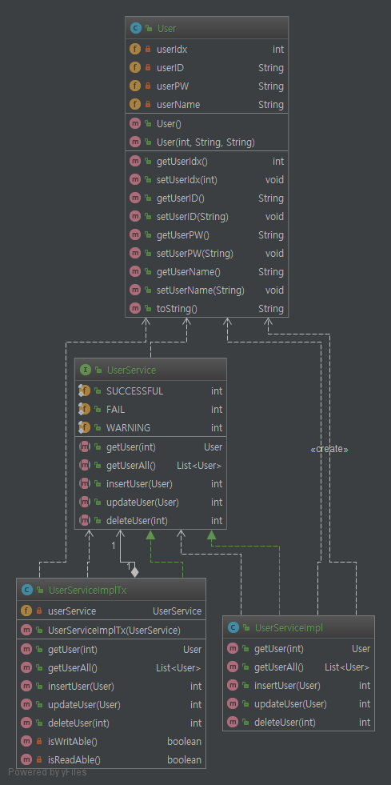
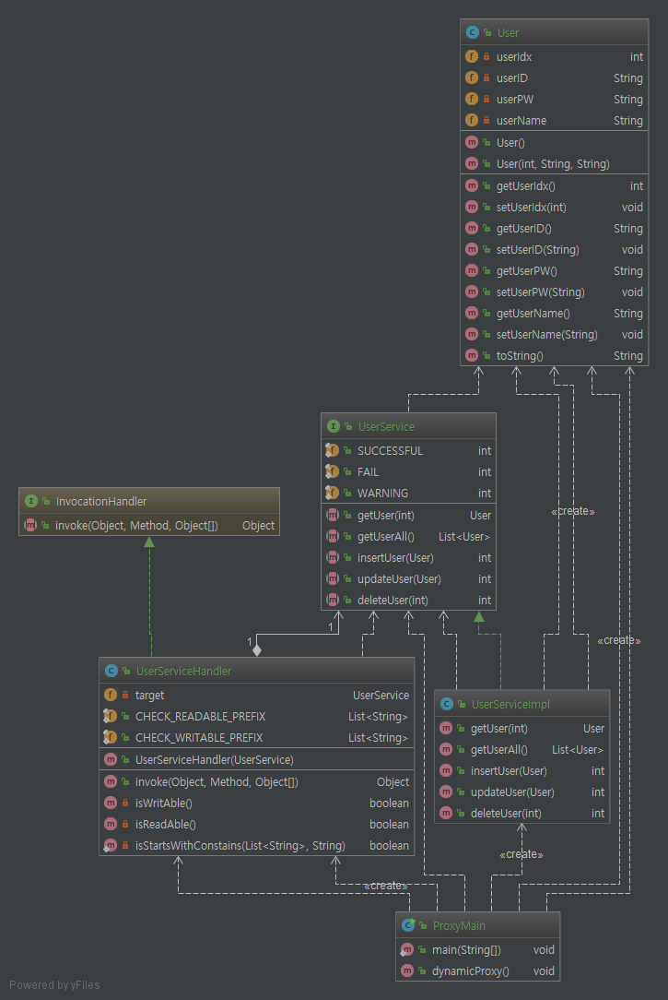

# Proxy Pattern.

# 1. 정의

    다른 객체를 대변하는 객체를 만들어서 주 객체에 대한 접근을 제어한다.
    데코레이션 패턴과 비슷하지만 어디까지나 용도가 다르고 활용하는 방법이 더 중요하다.

# 2. 특징

* 타깃과 같은 메소드를 구현하고 있다가 메소드가 호출되면 타깃 오브젝트로 위임한다.
* 지정된 요청에 대해서는 부가기능을 수행한다.


# 3. Code

```java
public static void main(String[] args) {

    UserService userService = new UserServiceImpl();
    UserService proxyUserService = new UserServiceImplTx(userService);

    userService.insertUser(new User());         //정상적으로 처리
    proxyUserService.insertUser(new User());    //쓰기 실패
}
```

일반적으로 위 소스처럼 serviceImpl(비지니스 로직을 담은 인스턴스)를 새로운 객체로 한번 감싸고,

사용할 때는 proxy 내부에서 권한 관련해서 체크 후, 메소드를 위임하는 형태로 호출한다(소스를 보는게 이해가 빠를듯 싶다).


# 4. 데코레이션 패턴과의 차이

구조적으로 보자면 프록시 패턴과 데코레이터 패턴은 비슷하다. 사실 용도가 다르다는 점이 가장 큰 차이점이고

클라이언트 쪽에선 인터페이스를 활용해 진짜 객체인지 아니면 프록시 객체인지 모른다는 점도 있다.

데코레이션은 행동을 추가(꾸며주는) 역할, 프록시는 대리인 정도로 생각하고 경우에 따라 응용하는 방향이 좋을꺼 같다.

# 5. Code Class diagram



클래스다이어그램을 보면 일반적인 구현체 클래스(`UserServiceImpl`)와 그 클래스를 주입받아 대리인 역할 및 

접근 제어 후, 구현체 클래스로 위임하는 프록시 클래스(`UserServiceImplTx`)를 확인할 수 있다.


# 5. 프록시 패턴의 문제점

`UserServiceImp` 클래스와 `UserServiceImplTx` 두 소스를 보았을 때, 별 필요없이 인터페이스의 메소드를

구현해야 할 때가 있을수 있다. 예를 들어 소스에서는 `isReadAble`메소드로 읽기 가능한지 체크 후 읽기 요청해야 했지만

읽기는 따로 체크가 필요없다고 가정해도 일일이 모든 읽기 메소드를 구현 및 위임하는 소스를 작성해야 한다.

또한 지금 소스 자체에도 `isReadAble`, `isWriteAble` 체크 하는 중복되는 부분이 많아 소스 질이 떨어진다고 생각할수 있다.

이러한 문제점을 해결하기 위하여 `다이나믹 프록시`가 나오게 됬다. 이는 리플렉션을 통해 동적으로 메소드를 호출하고,

체크하는 로직을 담기 때문에 중복 및 불필요한 구현하는데 생기는 문제점을 없애준다.

# 6. 다이나믹 프록시 (동적 프록시)

다이나믹 프록시가 나온 이유는 5에서 설명을 하였고, 이름이 동적 프록시인 이유는 실제 코드가 실행되기 전까지

클래스 자체가 없어서 이다. 전달해준 인터페이스로 즉석에서 클래스가 생성된다.

`newProxyInstance()`메소드의 인자값으로 반드시 인터페이스의 배열로 넘겨줘야하고(일반 클래스x) 똑같은 이름을

가진 인터페이스, 메소드가 있어서도 안된다. 

```java
public void dynamicProxy(){

        UserServiceHandler<UserService> userServiceHandler = new UserServiceHandler<>(new UserServiceImpl());
        UserService userService = (UserService) Proxy.newProxyInstance(
                getClass().getClassLoader(), new Class[]{UserService.class}, userServiceHandler);

        userService.insertUser(new User());     //쓰기 실패!
    }
```

직접적으로 리플렉션을 써서 직접 구현 해주는것 보단 훨씬 편하게 구현이 가능한것으로 생각된다.



`InvocationHandler` 인터페이스를 구현하고 내부적으로 리플렉션을 활용하여 일반 프록시 패턴의 단점을 보안해주는

다이나믹 프록시 패턴이다. 역시 구현체 클래스(`UserServiceImpl`)를 주입하여 내부적으로 메소드 호출 시, 호출

여부를 판단할 수가 있다. 리플렉션을 활용해서 그런지 반환형이나 타입등에서 조금 불안해 보이는게 단점(잠재적 버그)이다.