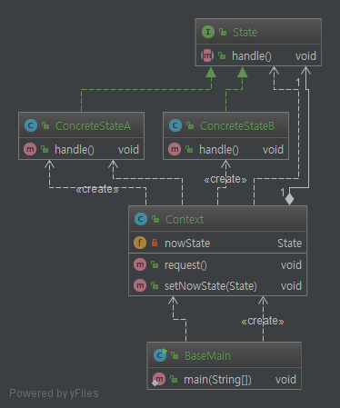
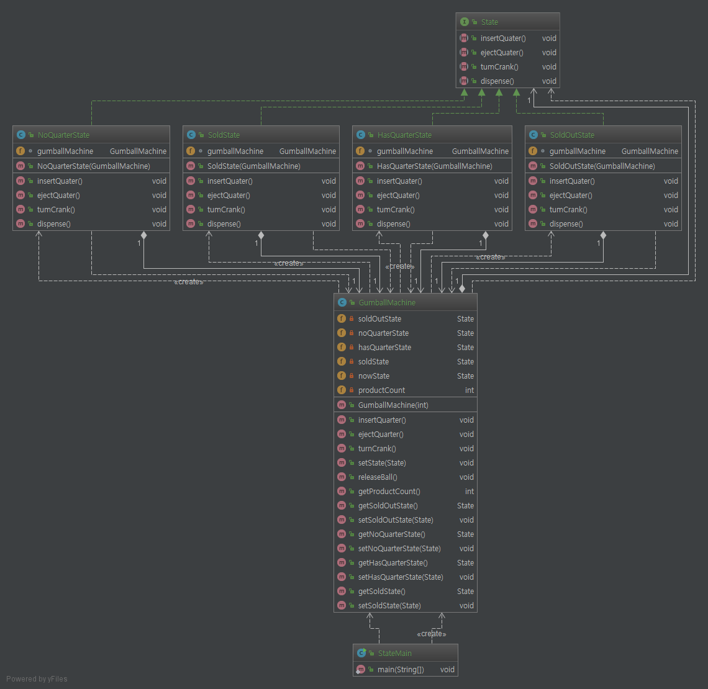

# State Pattern.

# 1. 정의
객체의 내부 상태가 바뀜에 따라서 객체의 행동을 바꿀 수 있다. 마치 객체의 클래스가

바뀌는 것과 같은 결과를 얻을 수가 있다.

# 2. 특징

* 각 상태를 변경에 대해서는 닫혀 있고, 새로운 상태 클래스를 추가하는 확장에는 열려있다(OCP).
* 각 상태의 행동을 클래스로 구현하여 if문을 없앴다.
* 클라이언트에서는 상태 객체하고 직접 연락하지 않는다.
* 상태 객체에 일련의 행동이 캡슐화 된다. 따라서 경우에 따라 클라이언트는 상태에 관해 몰라도 된다.(컨텍스트가 상태 관리)
* State를 인터페이스든 추상 클래스든 상관없다.
* Context 객체에서는 현재 상태에게 행동을 위임한다.
* 스테이트 패턴과 스트레티지 패턴의 클래스 다이어그램은 똑같지만 그 용도는 다르다.
* 상태 전환은 State 클래스에서 제어할 수도 있고, Context에서도 제어 할 수 있다.

    책에서는 디자인에 필요한 클래스의 개수가 많아지는 것에 따라서 유연성을 향상시키기 위해
    지불해야할 비용이라고 설명하고 있다. 클래스가 많아져도 클라이언트에 노출되는 클래스의 개수
    가 중요하고 나머지 클래스를 숨길 수도 있다는 점을 중요하게 설명하고, state 패턴을 쓰지 않으면
    정말 복잡한 조건문을 사용해야 할 수밖에 없다고 설명하였다.

# 3. Code

```java

    public void insertQuarter(){
            nowState.insertQuater();
        }

    public void ejectQuarter(){
        nowState.ejectQuater();
    }

    public void turnCrank(){
        nowState.tumCrank();
        nowState.dispense();
    }
    
```

코드 자체는 딱히 어려운게 없어서... 위 소스는 Context 의 일부 메소드로, Context 객체에서는

현재 상태에게 행동을 위임한다.

# 4. Code Class diagram

코드 자체는 쉬워도 따로 설명은 pass

### 4.1 base class diagram


### 4.2 GumballMachine class diagram
