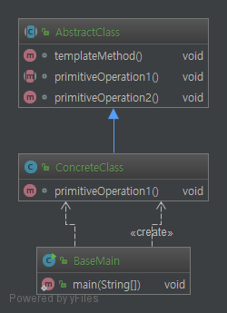
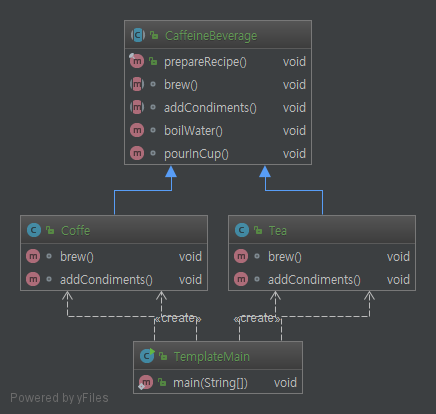

# Template Pattern.

# 1. 정의

메소드에서 알고리즘의 골격을 정의한다. 알고리즘의 여러 단계 중 일부는 서브클래스
에서 구현을 한다. 템플릿 메소드를 이용하면 알고리즘의 구조는 그대로 유지하면서
서브클래스에서 특정 단계를 재정의 할수가 있다.

# 2. 특징

* 상위 클래스에서 처리의 흐름을 제어하며, 하위클래스에서 처리의 내용을 구체화한다.
* 여러 클래스에 공통되는 사항은 상위 추상 클래스에서 구현하고, 각각의 상세부분은 하위 클래스에서 구현한다.
* 공통된 로직을 묶어서 공유하므로 코드 재사용에 크게 도움된다.
* 서브클래스에서 로직을 함부로 바꾸기를 원치 않으면 final 선언
* 상위 클래스에서 접근 지정자를 명확히 한다.
* 팩토리 메소드 패턴은 특화된 템플릿 메소드이다.

    팩토리 패턴은 특화된 템플릿 메소드 패턴이라 하는 이유는 기본 단계(primitive operation)에서
    객체를 생성하고 리턴한다(팩토리 패턴 안에 템플릿 패턴이 포함되어 있음).

# 3. Code

```java
public abstract class AbstractClass {

    void templateMethod(){
        primitiveOperation1();
        primitiveOperation2();
    }

    abstract void primitiveOperation1();

    abstract void primitiveOperation2();
}
```

바뀔 수 있는 부분은 추상화 하여 서브 클래스에서 구현하여 알고리즘을 완성한다.
간단하지만 디자인 패턴에서 가장 많이 사용하는 형태라고 할 수 있다.


# 4. Code Class diagram

코드 자체는 쉬워도 따로 설명은 pass

### 4.1 base class diagram


### 4.2 CaffeineBeverage class diagram
